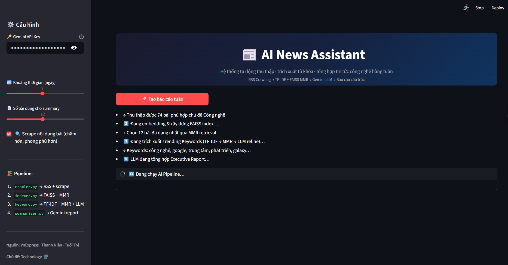
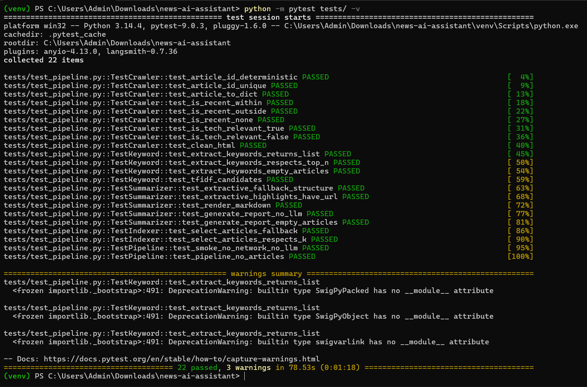
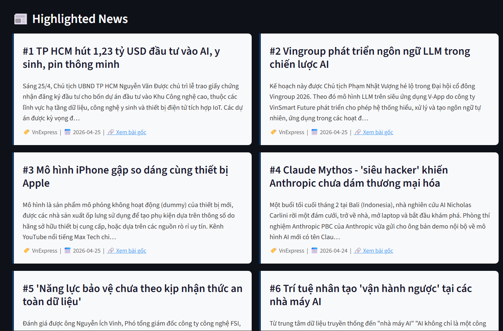
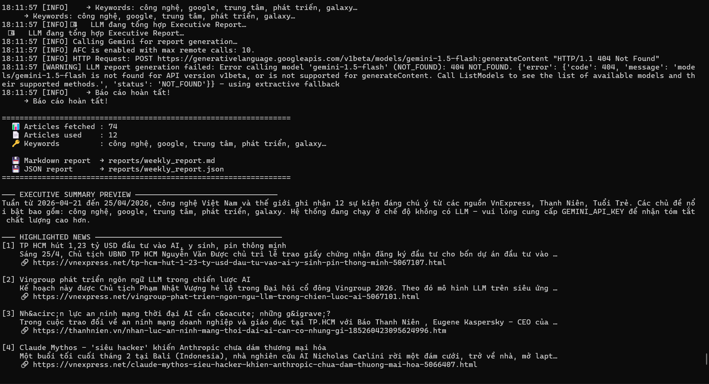
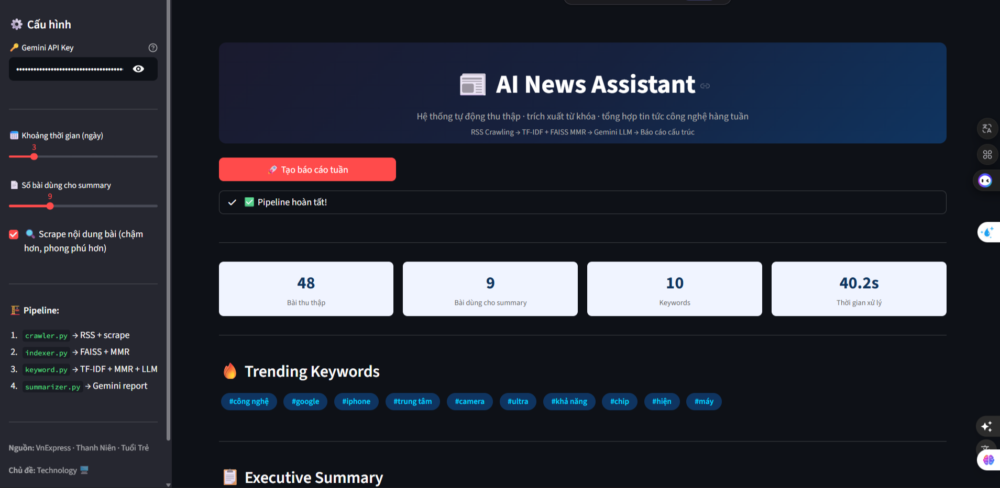

<div align="center">
  <h1>📰 AI News Assistant</h1>
  <p><em>Intelligent Assistant for Weekly Technology News – Collect · Filter · Summarize</em></p>

  []()
  []()
  []()
  []()
  []()
</div>

---

## 📖 Project Overview

This project implements an **end-to-end AI-powered news intelligence system** that automatically collects, filters, ranks, and summarizes Vietnamese technology news from **VnExpress, Thanh Niên, and Tuổi Trẻ** into a structured weekly digest.

Built as a submission for the **PCA Company Services – AI Engineer Intern Technical Assessment**.

### Key Features
- **Automated Ingestion**: RSS crawling + article body scraping from 3 major Vietnamese news sources
- **Semantic Ranking**: FAISS vector index + MMR (Maximal Marginal Relevance) for diverse article selection
- **Hybrid Keyword Extraction**: 3-stage pipeline — TF-IDF → FAISS MMR → Gemini LLM refinement
- **LLM Summarization**: Google Gemini 2.0 Flash via LangChain generates structured Executive Summary
- **Dual Interface**: CLI for backend automation + Streamlit web UI for interactive use
- **Graceful Fallback**: Extractive summarization works with zero API key — pipeline always produces output
- **22 Unit Tests**: Full pytest coverage across all pipeline modules

---

## 🏗️ System Architecture

<div align="center">
  
</div>

| # | Module | Technology | What it does |
|---|--------|-----------|-------------|
| 1 | `crawler.py` | feedparser + httpx + BeautifulSoup | Parse RSS, filter 7 days, scrape body, deduplicate by URL |
| 2 | `indexer.py` | sentence-transformers + FAISS IndexFlatIP | Embed articles → MMR retrieval for top-K diverse articles |
| 3 | `kw_extractor.py` | scikit-learn TF-IDF + FAISS + Gemini | 3-stage hybrid keyword extraction |
| 4 | `summarizer.py` | LangChain + Gemini 2.0 Flash | Executive summary + highlighted news as structured JSON |
| 5 | `pipeline.py` | Python orchestrator | Single `run()` function shared by CLI and UI |

**Data flow:**
```
Crawl → Raw Data → Indexing → MMR Retrieval → Keyword Extraction → Summarization → Output
```

---

## 📊 Live Results (Actual Run – April 25, 2026)

| Metric | Result |
|--------|--------|
| 📰 Articles fetched | **74 bài** từ VnExpress, Thanh Niên, Tuổi Trẻ |
| 📄 Articles used for summary | **12 bài** (MMR selected) |
| 🔑 Keywords extracted | **10 từ khóa** trending |
| ⏱️ Processing time | **~40 giây** end-to-end |
| ✅ Test results | **22/22 passed** |

### Trending Keywords (actual output)
`#công nghệ` `#google` `#iphone` `#trung tâm` `#camera` `#ultra` `#khả năng` `#chip` `#hiện` `#máy`

### Highlighted News (actual output)
```
[1] TP HCM hút 1,23 tỷ USD đầu tư vào AI, y sinh, pin thông minh
    → https://vnexpress.net/tp-hcm-hut-1-23-ty-usd-dau-tu-vao-ai...

[2] Vingroup phát triển ngôn ngữ LLM trong chiến lược AI
    → https://vnexpress.net/vingroup-phat-trien-ngon-ngu-llm...

[3] Mô hình iPhone gập so dáng cùng thiết bị Apple
    → https://vnexpress.net/...

[4] Claude Mythos - 'siêu hacker' khiến Anthropic chưa dám thương mại hóa
    → https://vnexpress.net/claude-mythos-sieu-hacker...

[5] 'Năng lực bảo vệ chưa theo kịp nhận thức an toàn dữ liệu'
[6] Trí tuệ nhân tạo 'vận hành ngược' tại các nhà máy AI
```

---

## 🚀 Quick Start

### 1. Clone & Install
```bash
git clone https://github.com/hoangbaoro2003/news-ai-assistant.git
cd news-ai-assistant

python -m venv venv
venv\Scripts\activate        # Windows
# source venv/bin/activate   # Mac/Linux

pip install -r requirements.txt
```

### 2. Configure API Key (optional)
```bash
copy .env.example .env
# Mở .env, điền GEMINI_API_KEY
# Lấy key miễn phí tại: https://aistudio.google.com/apikey
```
> **Không có API key?** Hệ thống vẫn chạy với Extractive Mode — không cần đăng ký.

### 3. Run

**Mode A – Streamlit Web UI**
```bash
streamlit run app/ui.py
# → Mở trình duyệt tại http://localhost:8501
```

**Mode B – CLI**
```bash
# Extractive mode (không cần API key)
python app/main_cli.py

# Với Gemini API
python app/main_cli.py --api-key AIza...
```

**Run tests**
```bash
python -m pytest tests/ -v
# → 22 passed ✅
```

---

## 📂 Project Structure

```text
news-ai-assistant/
├── app/
│   ├── __init__.py
│   ├── crawler.py        # RSS collection + scraping + topic filter
│   ├── indexer.py        # FAISS vector index + MMR article retrieval
│   ├── kw_extractor.py   # TF-IDF → MMR → LLM keyword extraction
│   ├── summarizer.py     # Gemini report generation + extractive fallback
│   ├── pipeline.py       # Central orchestrator (CLI + UI share this)
│   ├── main_cli.py       # CLI entry point → exports .md + .json
│   └── ui.py             # Streamlit web interface
│
├── data/
│   └── raw_articles.json     # Auto-saved raw crawl output
│
├── images/
│   ├── AI NEWS ASSISTANT Architecture.png      # System architecture diagram
│   ├── 01-streamlit-ui.png
│   ├── 02-pytest-results.png
│   ├── 03-highlighted-news.png
│   ├── 04-cli-output.png
│   └── 05-streamlit-report.png
│
├── reports/
│   ├── weekly_report.md      # Generated Markdown report
│   ├── weekly_report.json    # Generated JSON report
│   └── sample_report.json    # Pre-generated demo output
│
├── tests/
│   └── test_pipeline.py      # 22 unit + integration tests
│
├── .env.example
├── requirements.txt
└── README.md
```

---

## 🧪 Test Results

```
platform win32 -- Python 3.14.4, pytest-9.0.3

22 passed, 3 warnings in 78.53s ✅

TestCrawler    (9 tests)  → All PASSED ✅
TestKeyword    (4 tests)  → All PASSED ✅
TestSummarizer (5 tests)  → All PASSED ✅
TestIndexer    (2 tests)  → All PASSED ✅
TestPipeline   (2 tests)  → All PASSED ✅
```

---

## 🖼️ Screenshots

### 1. Streamlit Web UI


### 2. pytest – 22 Tests Passed


### 3. Highlighted News Cards


### 4. CLI Output


### 5. Full Report on Streamlit


---

## 🌐 CLI Options

```
python app/main_cli.py [OPTIONS]

  --api-key     Gemini API key (hoặc GEMINI_API_KEY env var)
  --days        Lookback window in days (default: 7)
  --top-k       Articles used for summarization (default: 12)
  --no-scrape   Skip body scraping for faster runs
  --output-md   Markdown report path
  --output-json JSON report path
```

---

## 🛠️ Tech Stack

| Layer | Technology | Role |
|-------|-----------|------|
| Language | Python 3.10+ | Core |
| RSS Parsing | `feedparser` | Structured news ingestion |
| Scraping | `httpx` + `beautifulsoup4` | Article body extraction |
| Classic ML | `scikit-learn` TF-IDF | Statistical keyword extraction |
| Embeddings | `sentence-transformers` (multilingual) | Semantic article representation |
| Vector Search | `FAISS` IndexFlatIP (CPU) | Fast cosine similarity retrieval |
| Diversity | MMR algorithm | Avoids near-duplicate articles/keywords |
| LLM | Google Gemini 2.0 Flash via `LangChain` | Executive summary generation |
| Web UI | `Streamlit` | Interactive browser interface |
| Testing | `pytest` (22 tests) | Unit + integration coverage |

---

_Author: Trần Lê Hoàng Bảo – Built for PCA Company Services AI Engineer Intern Assessment 2026_
